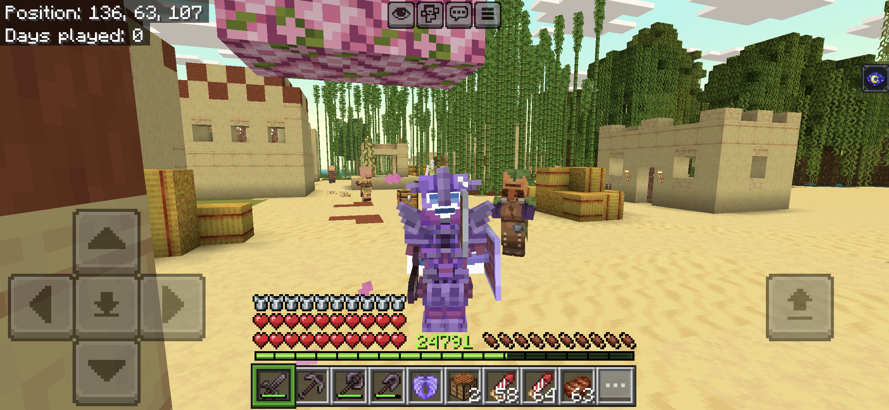
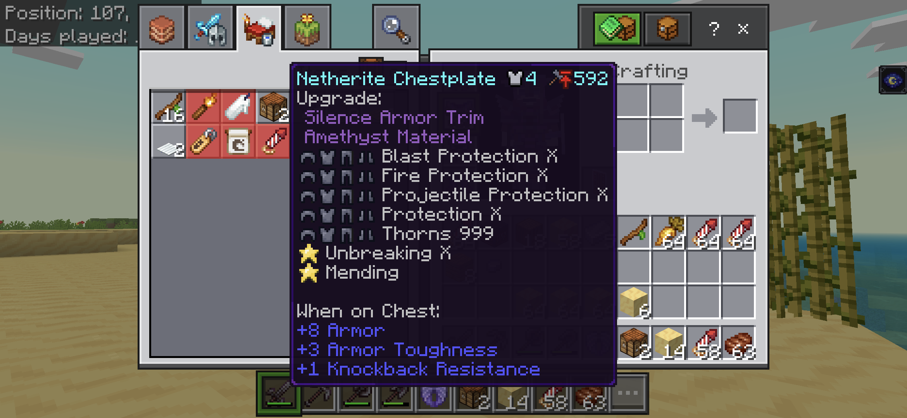

# mcpeworld

A command-line world editor for Minecraft Bedrock Edition (MCPE). Edit level.dat settings, player inventory, armor (with trim support), ender chest, status effects, entities, and tile entities - all through an interactive terminal interface.

Ported from the Android app [`dev.astler.inventoryeditormc`](https://github.com/AstlerDev/InventoryEditorMC), which stopped working after Android restricted access to `Android/data/`.

## Table of Content
- [mcpeworld](#mcpeworld)
	- [Table of Content](#table-of-content)
	- [Screenshots](#screenshots)
	- [Requirements](#requirements)
	- [Setup](#setup)
	- [Usage](#usage)
		- [Database Updates](#database-updates)
	- [What You Can Edit](#what-you-can-edit)
		- [World Settings (level.dat)](#world-settings-leveldat)
		- [Player Inventory](#player-inventory)
		- [Armor](#armor)
		- [Ender Chest](#ender-chest)
		- [Status Effects](#status-effects)
		- [Entities](#entities)
		- [Tile Entities](#tile-entities)
		- [Backups](#backups)
		- [Import / Export](#import--export)
	- [World Storage](#world-storage)
	- [Technical Notes](#technical-notes)
	- [License](#license)


## Screenshots





## Requirements

- Python 3.13+
- Linux (tested on Debian/Parrot)

## Setup

```bash
python -m venv virtual
source virtual/bin/activate
pip install -e .
```

## Usage

Launch the interactive editor:

```bash
mcpeworld
```

Or run directly:

```bash
python -m mcpeworld
```

### Database Updates

Item, enchantment, effect, and armor trim data is fetched from [minecraft.wiki](https://minecraft.wiki) and cached in a local SQLite database. On first run, enchantments, effects, and trims are populated automatically. Items must be fetched manually.

```bash
mcpeworld --update-item
mcpeworld --update-enchantment
mcpeworld --update-effect
mcpeworld --update-trim
mcpeworld --update-all
```

## What You Can Edit

### World Settings (level.dat)

World name, seed, game mode, difficulty, time, spawn position, generator type, cheats toggle, player health, player level, and 22 game rules.

### Player Inventory

All 36 inventory slots - change items (fuzzy search from database), stack size, damage value, custom display names, and enchantments filtered by item category.

### Armor

Head, chest plate, leggings, boots, and off-hand slots. Supports armor trim editing - pick a pattern and material from the database, stored as `tag.Trim.Material` / `tag.Trim.Pattern` in NBT.

### Ender Chest

Same editing capabilities as the main inventory.

### Status Effects

Add, edit, and remove active effects. Supports setting amplifier level (1–255), duration in seconds, and infinite duration.

### Entities

Browse all entities in loaded chunks with health, position, baby/tamed status, equipment, and variant info. Edit health, custom name, position, or delete entities entirely.

### Tile Entities

Grouped by type for easier navigation. Editable tile entities:

- **Signs / Hanging Signs** - front and back text
- **Command Blocks** - command string
- **Mob Spawners** - entity identifier
- **Beds** - color
- **Banners** - base color and pattern layers
- **Containers** (Chests, Furnaces, Barrels, Brewing Stands, Blast Furnaces, Smokers, Shulker Boxes, Chiseled Bookshelves) - add, edit, and remove items
- **Campfires** - edit each of the 4 item slots
- **Item Frames / Glow Item Frames** - set or clear the displayed item

### Backups

Automatic backup on first world open. Manual backup creation and restoration from the Backups menu.

### Import / Export

Import worlds from a folder or `.mcworld` file (ZIP archive). Export worlds back to `.mcworld`.

## World Storage

Working worlds live in `resources/mcworlds/`. Backups are stored in `resources/mcworlds/.backups/{worldId}/{timestamp}/`.

## Technical Notes

- Bedrock uses Little Endian NBT with standard UTF-8 encoding
- `.mcworld` files are ZIP archives containing a world folder
- LevelDB stores player data under the `~local_player` key
- `level.dat` has an 8-byte header before the NBT payload
- Item enchantments are filtered by category (swords get sword enchantments, armor gets protection, etc.)

## License

All **mcpeworld** source code is licensed under the GNU General Public License v3. Please [see](https://www.gnu.org/licenses) the original document for more details.

This project is not affiliated with Mojang or Microsoft.
